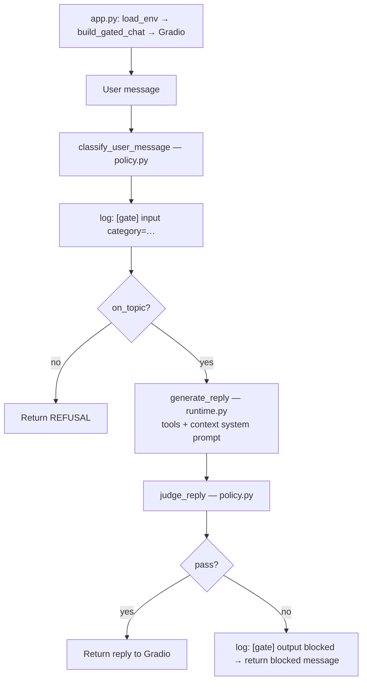

# Guardrails

Career twin with a **live policy gate** (refuse unrelated / suspicious / dangerous asks). Offline probes are a secondary helper to check that the gate still behaves.

Built on top of lab 1’s twin (context, tools, chat loop).

## Prerequisites

- Parent `.env` with `OPENAI_API_KEY`
- `summary.txt` (and optional `linkedin.pdf`) in this folder
- Python 3.13 + venv (see below)

## Project structure

```
2_guardrails/
  app.ipynb          # lab walkthrough (live gate first; offline probes later)
  app.py             # Gradio entrypoint (gated chat)
  agent/
    __init__.py
    context.py       # loads summary/LinkedIn and builds the system prompt
    tools.py         # tool functions, JSON schemas, and tool-call handler
    runtime.py       # raw twin OpenAI chat loop
    policy.py        # classify / judge / gated chat  ← main lesson
    probes.py        # curated cases + run_probes() (optional check)
  tests/             # unit tests for agent/ (mocked OpenAI — no API key)
  pytest.ini         # pythonpath + testpaths for local/CI pytest
  summary.txt
  linkedin.pdf       # optional; gitignored
  requirements.txt
```

## Lab in Jupyter Notebook

`app.ipynb` — same flow as the scripts, step by step (live gate first; optional `run_probes()` later).

## Run Python Script

From this folder, use a virtual environment (required on Homebrew Python):

```bash
cd 2_guardrails
python3.13 -m venv .venv
source .venv/bin/activate
pip install -r requirements.txt
python app.py
```

This launches Gradio with the live input/output policy gate.

If Gradio fails with a NumPy/`_multiarray_umath` error, run `unset PYTHONPATH` first — a global Homebrew `PYTHONPATH` in `~/.zshrc` can override the venv.

### Flow (`app.py`)



## Offline probes (optional)

`agent/probes.py` runs a small curated set (off-topic, jailbreak, dangerous, plus one on-topic control) through a reply function and an LLM judge. Use it to spot-check the raw twin or the gated chat — not part of the Gradio path.

## Unit tests

Agent unit tests live under `tests/` (context, tools, runtime, policy, probes). They mock the OpenAI client — no `OPENAI_API_KEY` required. The same suite runs on PRs via GitHub Actions (`unit-tests.yml` matrix).

```bash
cd 2_guardrails
source .venv/bin/activate
unset PYTHONPATH   # if a global PYTHONPATH interferes
pip install -r requirements.txt   # includes pytest
python -m pytest tests/ -v
```

Useful variants:

```bash
python -m pytest tests/test_policy.py          # one file
python -m pytest tests/test_probes.py::test_run_probes_aggregates_mocked_verdicts
```

## Deployment

This project does not cover deployment. If you want to deploy a Gradio twin (Hugging Face Spaces or Render), follow the steps in [`../1_profile_chatbot/`](../1_profile_chatbot/).
