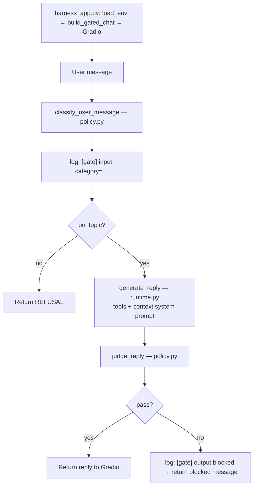

# Prompt harness

Career twin with offline evaluation probes and a live policy gate (refuse unrelated / suspicious / dangerous asks).

## Prerequisites

- Parent `.env` with `OPENAI_API_KEY`
- `summary.txt` (and optional `linkedin.pdf`) in this folder
- Python 3.13 + venv (see below)

## Project structure

```
2_harness/
  harness_app.ipynb  # lab walkthrough (notebook + offline harness)
  harness_app.py     # Gradio entrypoint (gated chat)
  agent/
    __init__.py
    context.py       # loads summary/LinkedIn and builds the system prompt
    tools.py         # tool functions, JSON schemas, and tool-call handler
    runtime.py       # raw twin OpenAI chat loop
    policy.py        # classify / judge / gated chat
    harness.py       # curated cases + run_harness()
  tests/             # unit tests for agent/ (mocked OpenAI — no API key)
  pytest.ini         # pythonpath + testpaths for local/CI pytest
  summary.txt
  linkedin.pdf       # optional; gitignored
  requirements.txt
```

## Lab in Jupyter Notebook

`harness_app.ipynb` — same flow as the scripts, step by step (includes offline `run_harness()` probes).

## Run Python Script

From this folder, use a virtual environment (required on Homebrew Python):

```bash
cd 2_harness
python3.13 -m venv .venv
source .venv/bin/activate
pip install -r requirements.txt
python harness_app.py
```

This launches Gradio with the live input/output policy gate.

If Gradio fails with a NumPy/`_multiarray_umath` error, run `unset PYTHONPATH` first — a global Homebrew `PYTHONPATH` in `~/.zshrc` can override the venv.

### Flow (`harness_app.py`)



## Deployment

This project does not cover deployment. If you want to deploy a Gradio twin (Hugging Face Spaces or Render), follow the steps in [`../1_profile_chatbot/`](../1_profile_chatbot/).
