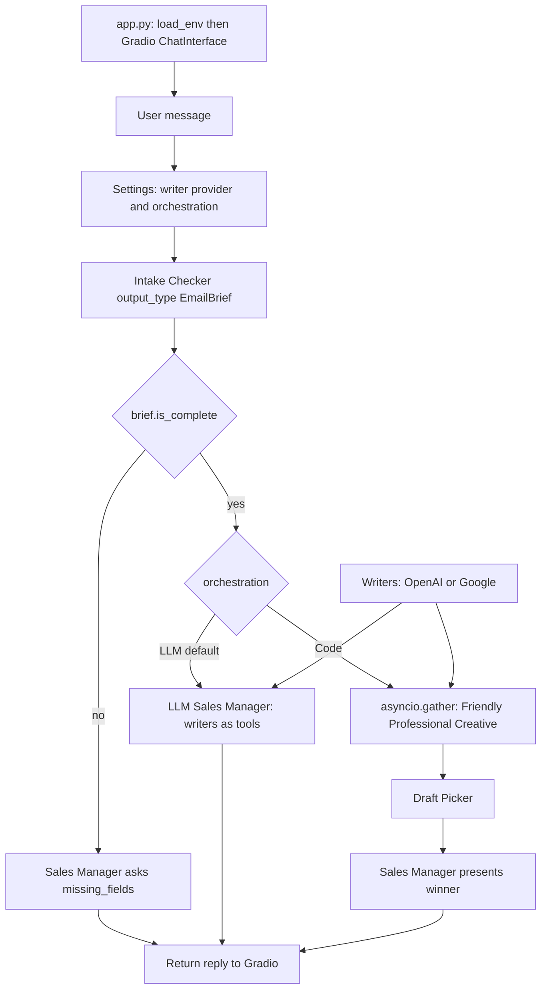

# OpenAI Agents SDK

Practice lab for the [OpenAI Agents SDK](https://openai.github.io/openai-agents-python/) (`openai-agents` on PyPI). Merges Week 2 course notebooks:

- [1_lab1.ipynb](https://github.com/ed-donner/agents/blob/main/2_openai/1_lab1.ipynb) — Agent, Runner, traces, tools, sessions
- [2_lab2.ipynb](https://github.com/ed-donner/agents/blob/main/2_openai/2_lab2.ipynb) — multi-agent orchestration (code + LLM)
- [3_lab3.ipynb](https://github.com/ed-donner/agents/blob/main/2_openai/3_lab3.ipynb) — other models, structured outputs, guardrails

## Prerequisites

- Parent `.env` with `OPENAI_API_KEY`
- Optional: `GOOGLE_API_KEY` for Google/Gemini writers in Sales Email Studio (and notebook Stage 7); `PUSHOVER_USER` / `PUSHOVER_TOKEN` for notify tools
- Python 3.13 + venv (see below)

Install the SDK as `openai-agents` — not the unrelated `agents` package on PyPI.

## Project structure

```
3_openai_agent/
  openai_agent.ipynb  # staged walkthrough
  app.py              # Gradio Sales Email Studio
  agent/
    brief.py          # EmailBrief + merge across turns
    agents.py         # 6 Agent constructors + LLM manager (writers as tools)
    providers.py      # OpenAI vs Google writer models; llm vs code
    guardrails.py     # intake tripwire + SDK @input_guardrail
    orchestrate.py    # turn: intake → ask or draft (LLM or code)
    runtime.py        # load_env, MODEL
  tests/              # brief merge + incomplete brief blocks writers
  requirements.txt
  README.md
```

## Lab in Jupyter Notebook

From this folder:

```bash
cd 3_openai_agent
python3.13 -m venv .venv
source .venv/bin/activate
pip install -r requirements.txt
# open openai_agent.ipynb and select this venv as the kernel
```

If a global Homebrew `PYTHONPATH` interferes, run `unset PYTHONPATH` first.

### Practice arc

Work the stages in `openai_agent.ipynb` in order:

| Stage | Focus | Checkpoint |
|------|--------|------------|
| 1 | SDK hello — `Agent` + `Runner` | One agent reply works |
| 2 | Observability + streaming | Trace on [OpenAI traces](https://platform.openai.com/traces) |
| 3 | Function tools (`@function_tool`) | Tool call visible in the trace |
| 4 | Memory / sessions | Name remembered across two `Runner.run` calls |
| 5 | Orchestrate by code | Parallel drafts → picker (optional send) |
| 6 | Orchestrate by LLM | Manager via agents-as-tools, then handoffs |
| 7 | Other providers / models | Non-OpenAI model (e.g. Gemini) via OpenAI-compatible client |
| 8 | Structured outputs | `final_output` is a Pydantic object |
| 9 | Guardrails | DIY checker and/or SDK `@output_guardrail` |

Delivery (email/SMTP) is optional. Prefer Pushover or a dry-run print tool so the focus stays on agents. Sandbox agents and MCP stay stretch-only in the notebook.

## Sales Email Studio


Python Gradio app on top of the notebook stages. A Sales Manager chat collects a brief, then drafts three styles. Defaults: OpenAI writers and **LLM** orchestration (manager with writers as tools). Switch to Google writers or code (`asyncio.gather` + picker) in Settings.

Six agents; only the Sales Manager talks to the user.

1. **Intake Checker** extracts `author`, `receiver`, `field`, `purpose` into `EmailBrief`.
2. If the brief is incomplete, the Manager asks for `missing_fields` — writers do not run.
3. Once complete, drafting depends on **Orchestration** (Settings):
   - **LLM (default):** Sales Manager calls the three writers as tools and presents the winner.
   - **Code:** Friendly / Professional / Creative run in parallel (`asyncio.gather`), then **Draft Picker** chooses; the chat Manager presents it.
4. **Writer provider** (Settings): OpenAI (default) or Google (`gemini-3.8-flash` via `GOOGLE_API_KEY`; override with `GEMINI_MODEL` in `.env`, or change `GEMINI_MODEL_NAME` in [`agent/providers.py`](agent/providers.py)). Only the three writers switch; intake, manager, and picker stay on OpenAI.

Writers, the picker, and the LLM manager also carry an `@input_guardrail` that trips if `RunContext.brief` is incomplete.

### Flow (`app.py`)



Intake, the chat-facing Sales Manager, and the Draft Picker stay on OpenAI. Only the three writers switch when Writer provider is Google.

`providers.py` checks that `OPENAI_API_KEY` is set (always) and that `GOOGLE_API_KEY` is set when writers are Google. Whitespace-only values count as missing. Keys are not sent to the provider just to validate them.

```bash
cd 3_openai_agent
python3.13 -m venv .venv
source .venv/bin/activate
pip install -r requirements.txt
python app.py
```

If Gradio fails with a NumPy/`_multiarray_umath` error, run `unset PYTHONPATH` first.

### Troubleshooting

Unexpected exceptions are returned in the chat (type + message), not as Gradio’s generic “Error”. The stored brief is kept.

**1. LLM orchestration: `MaxTurnsExceeded: Max turns (10) exceeded`**

The LLM Sales Manager calls writers as tools. `Runner.run` loops until the manager answers in prose (no more tool calls), or hits 10 turns. A failed writer tool (wrong Gemini id, 404, empty output) is sent **back to the manager**, which often **calls the same tools again**. That looks like “max retries” and can hide the real writer error.

Switch Settings → Orchestration **Code** and send the same request. Code runs each writer once (no manager tool loop), so the chat should show the underlying API error.

**2. Google: model no longer available**

Example: `This model models/gemini-2.5-flash-lite is no longer available to new users` (Gemini 2.5 is often limited to prior users). `gemini-2.0-flash` is shut down.

Update the Google writer id in [`agent/providers.py`](agent/providers.py) (`GEMINI_MODEL_NAME`), or set `GEMINI_MODEL` in the parent `.env` without a code change. Current default is `gemini-3.8-flash`. Alternatives: `gemini-3.5-flash-lite`, `gemini-3.5-flash`. Restart `python app.py` after changing the default (the Gemini client is cached in-process).

## Unit tests

```bash
cd 3_openai_agent
source .venv/bin/activate
unset PYTHONPATH   # if a global PYTHONPATH interferes
pip install -r requirements.txt
python -m pytest tests/ -v
```

Tests mock agent runs — no `OPENAI_API_KEY` required. The same suite runs on PRs via GitHub Actions (`unit-tests.yml` matrix includes `3_openai_agent`).
